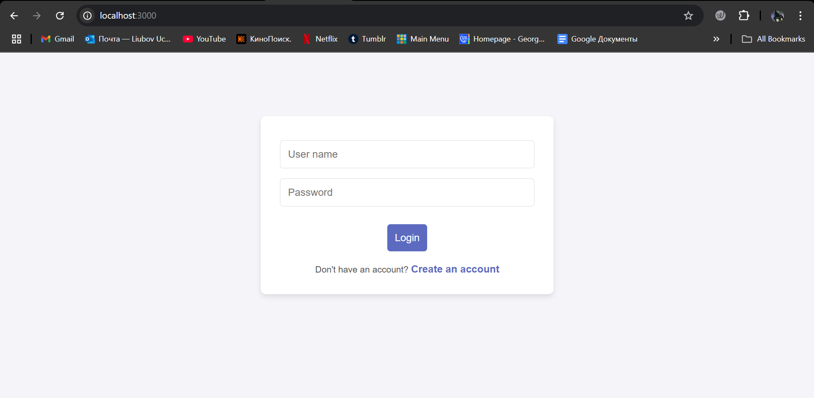
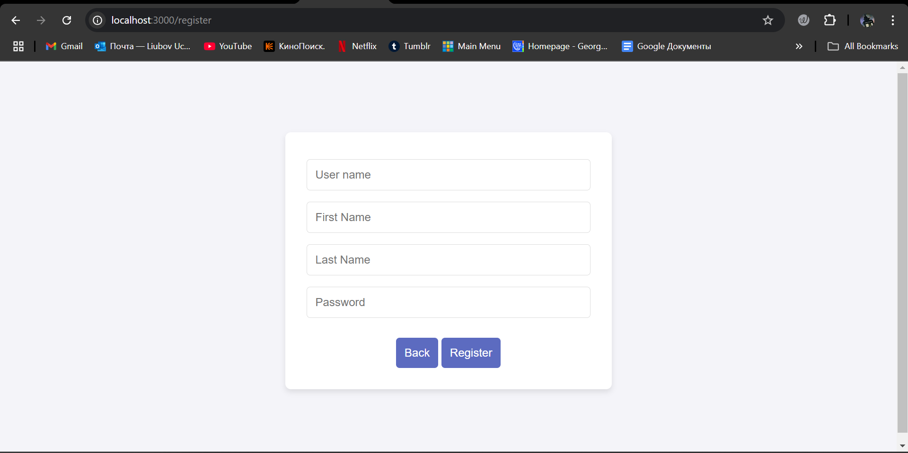
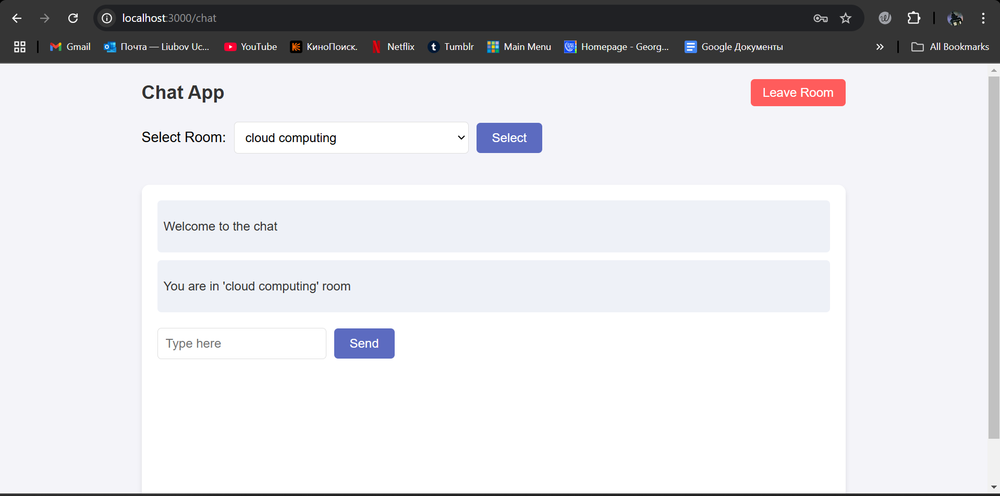
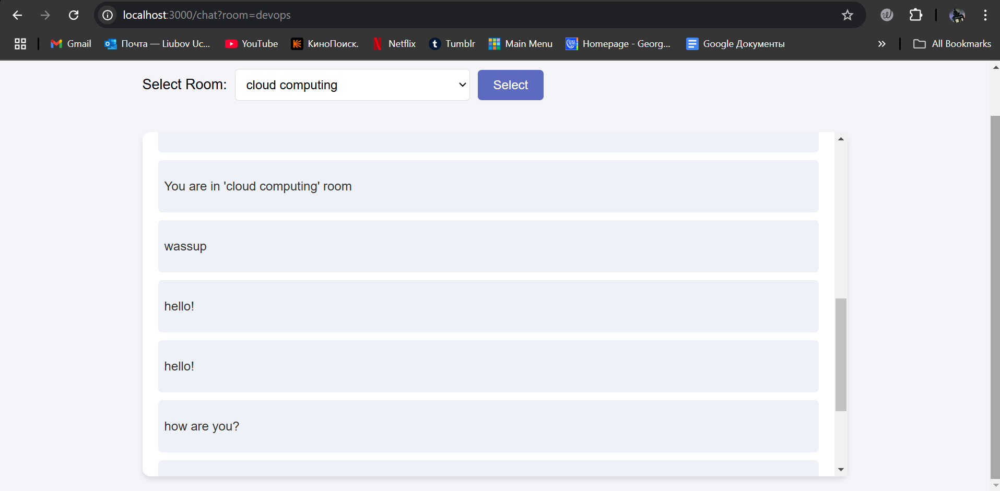

# Chat App

## Overview

A **Real-Time Chat Application** built with **Node.js** and **Socket.IO**. It allows users to join chat rooms, send messages, and view chat history stored in MongoDB.

### Features:
- Real-time messaging
- Multiple chat rooms (e.g., *devops*, *sports*)
- Message history (saved in MongoDB)
- Simple and responsive UI

## Tech Used:
- **Node.js**, **Socket.IO**, **MongoDB**, **Express.js**, **HTML/CSS**

